# Automotive Cruise Control — Model-Based Control

### Professional V2 | MATLAB & Simulink

A model-based automotive longitudinal control system developed and validated in MATLAB/Simulink, progressing from classical feedback control to state-space optimal control.

**P → PI → Filtered PID → LQR**

The project focuses on the engineering workflow:

**Model → Design → Analyze → Validate → Compare → Decide**

---

## 1. Project Objective

Develop a closed-loop cruise control system that regulates vehicle speed to a reference while evaluating:

* Tracking performance
* Transient response
* Steady-state error
* Control effort
* Controller sensitivity
* Actuator limitations
* MATLAB/Simulink agreement

The project is structured as an engineering study rather than a single controller implementation.

---

## 2. System Model

The baseline longitudinal vehicle model is:

$$
m\frac{dv}{dt}+bv=u
$$

with:

$$
G(s)=\frac{1}{ms+b}
$$

### Vehicle Parameters

| Parameter              |     Value |
| ---------------------- | --------: |
| Vehicle mass           |   1000 kg |
| Drag coefficient       |   50 Ns/m |
| Actuator time constant |     0.5 s |
| Maximum actuator force |     700 N |
| Gravity                | 9.81 m/s² |

For LQR, actuator dynamics are included in the state-space model.

---

## 3. Control Architecture

```text
          Speed Reference
                │
                ▼
        ┌───────────────┐
        │   Controller  │
        │ P / PI / PID  │
        │      / LQR    │
        └───────┬───────┘
                │
                ▼
        ┌───────────────┐
        │    Actuator   │
        │  τa = 0.5 s   │
        └───────┬───────┘
                │
                ▼
        ┌───────────────┐
        │ Vehicle Model │
        │ m dv/dt+bv=u  │
        └───────┬───────┘
                │
                ▼
          Vehicle Speed
                │
                └──────── Feedback
```

---

# 4. P Controller — Baseline

The P controller was established as the baseline for the complete control study.

### Selected Gain

```text
Kp = 500
```

### Performance

| Metric             |   Result |
| ------------------ | -------: |
| Rise Time          | 3.9946 s |
| Settling Time      | 7.1129 s |
| Overshoot          |      0 % |
| Steady-State Error |   0.0909 |
| Closed-loop Pole   |    -0.55 |

### Gain Sensitivity

The proportional gain was evaluated over:

```text
Kp = [50 100 200 500 1000 2000]
```

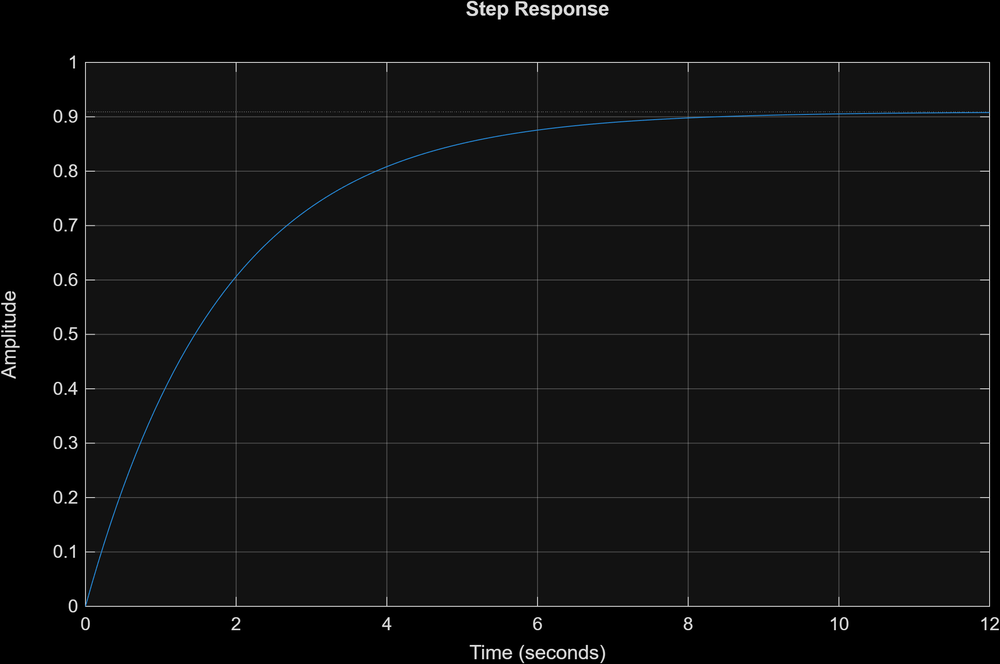

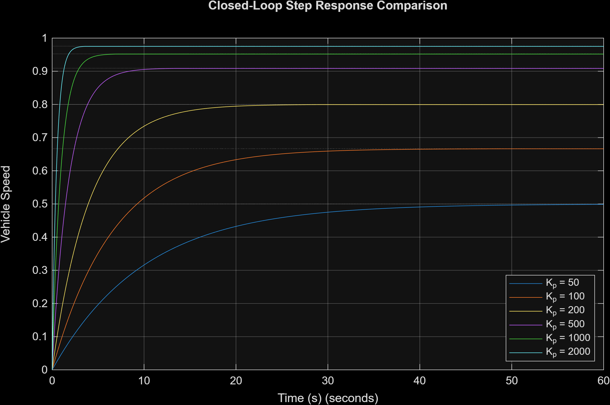

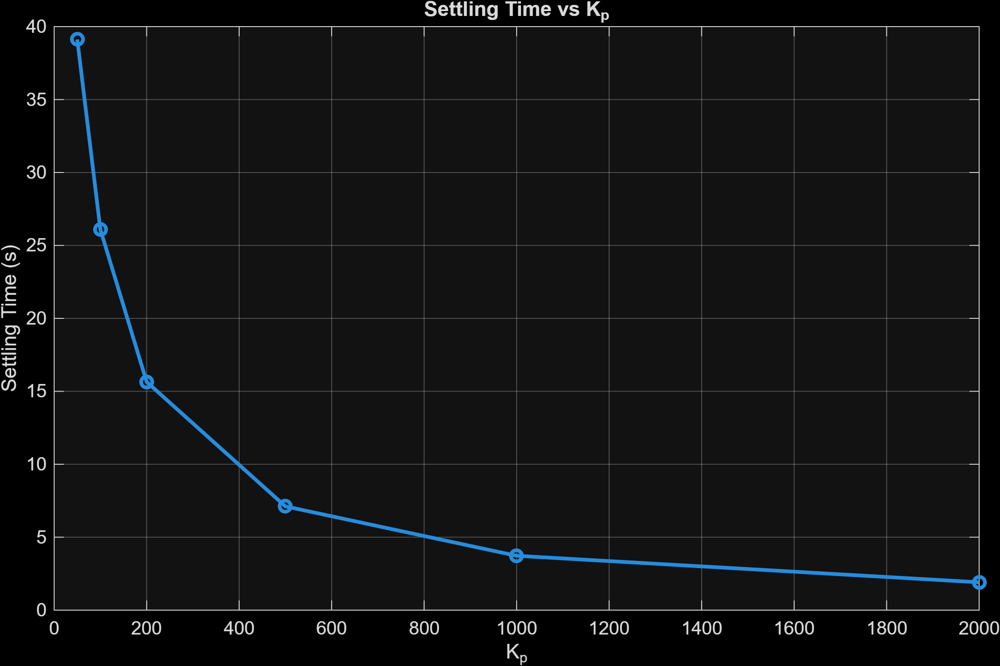

**Engineering outcome:** P control provides a stable baseline but retains steady-state tracking error.

---

# 5. PI Controller — Steady-State Error Reduction

Integral action was introduced to improve reference tracking.

### Selected Gains

```text
Kp = 500
Ki = 20
```

### Performance

| Metric             |           Result |
| ------------------ | ---------------: |
| Rise Time          |         4.6538 s |
| Settling Time      |        10.2954 s |
| Steady-State Error |         0.000459 |
| Closed-loop Poles  | -0.5108, -0.0392 |

The integral gain was evaluated over:

```text
Ki = [5 10 20 40 80]
```

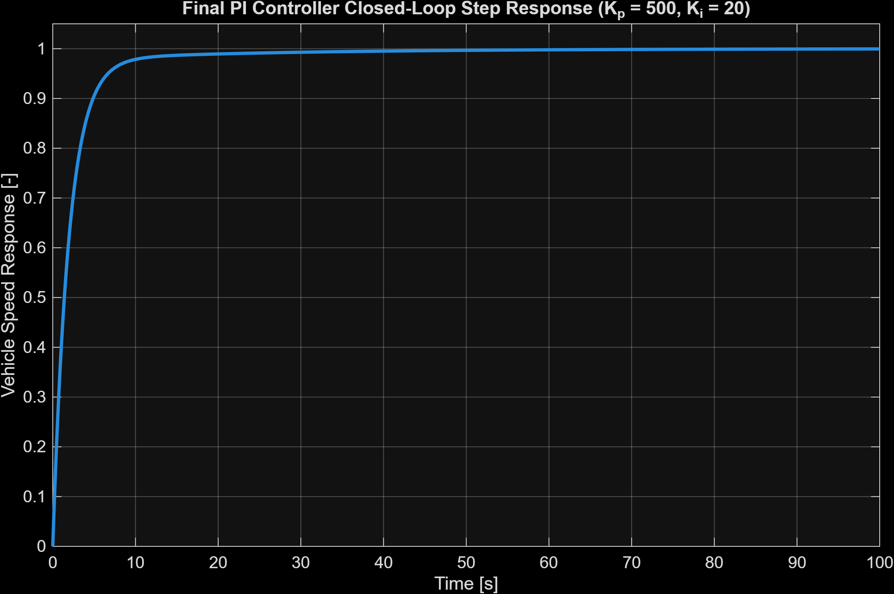

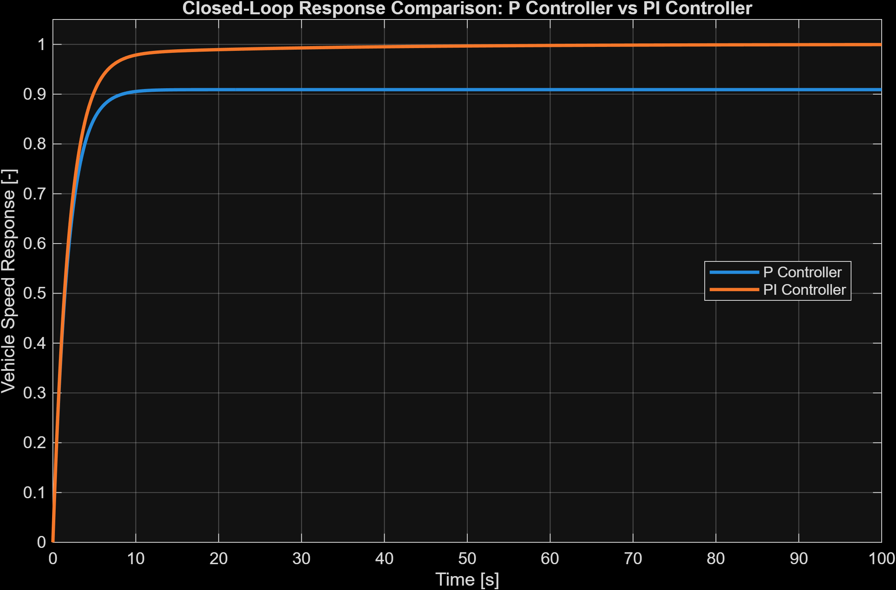

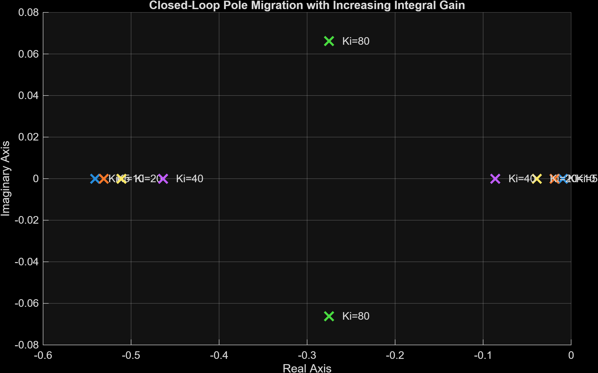

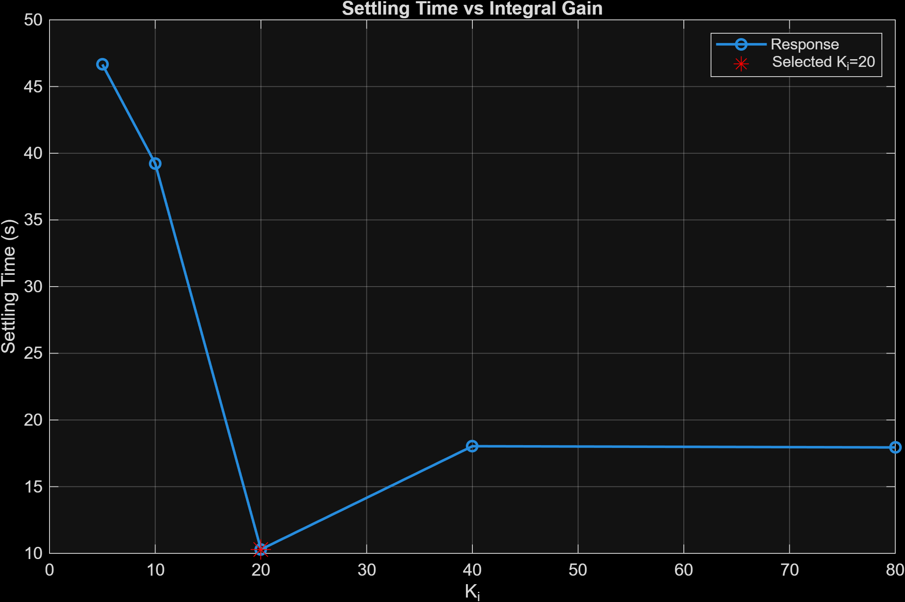

**Engineering outcome:** PI significantly reduces steady-state error, but aggressive integral action increases transient cost.

---

# 6. Filtered PID — Classical Performance Benchmark

Derivative action was introduced to improve transient behaviour.

A filtered derivative was used for practical implementation.

### Final PID Parameters

```text
Kp = 500
Ki = 30
Kd = 20
N  = 10
```

### Performance

| Metric             |     Result |
| ------------------ | ---------: |
| Rise Time          |   ≈ 4.26 s |
| Settling Time      |   ≈ 6.87 s |
| Overshoot          |   ≈ 1.03 % |
| Steady-State Error |        ≈ 0 |
| Control RMS        | ≈ 169.94 N |
| Control Peak       |      700 N |

A systematic gain search was performed over:

```text
Kp = [400 500 600]
Ki = [10 20 30]
Kd = [0 10 20]
```

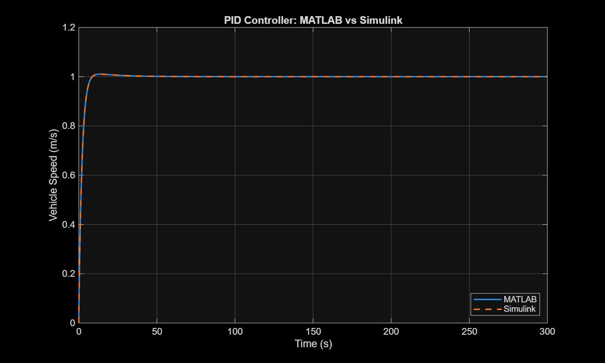

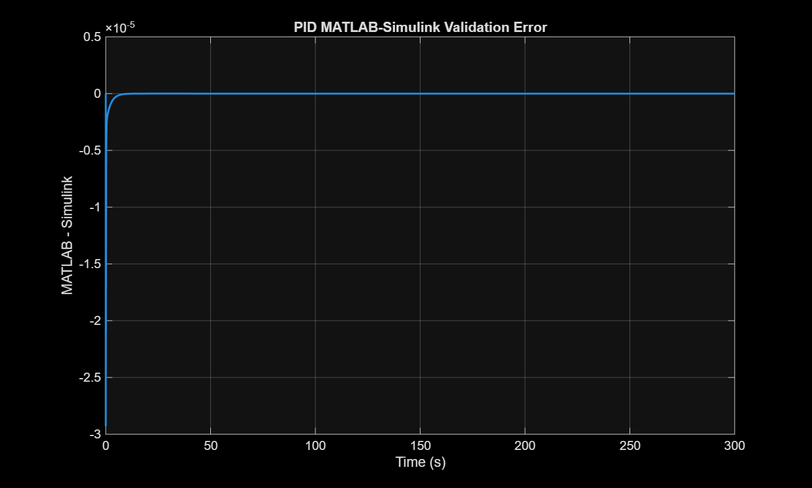

**Engineering outcome:** Filtered PID provides a strong classical-control benchmark while maintaining practical derivative behaviour.

---

# 7. LQR — State-Space Optimal Control

LQR was introduced as the modern control benchmark.

The augmented state vector is:

$$
x=
\begin{bmatrix}
v\\
F_a
\end{bmatrix}
$$

where \(v\) is vehicle speed and \(F_a\) is actuator force.

### Baseline Weighting

```text
Q = [1 0;
     0 0]

R = 2.0408e-6
```

### Controller Gain

```text
K = [637.7980  0.2798]
```

### Closed-Loop Poles

```text
-0.7581
-1.8514
```

### Controllability

```text
Rank = 2 / 2
```

### Performance

| Metric             |     Result |
| ------------------ | ---------: |
| Rise Time          |   3.2642 s |
| Settling Time      |   5.8520 s |
| Overshoot          |        0 % |
| Final Speed        | 1.0000 m/s |
| Steady-State Error |          0 |

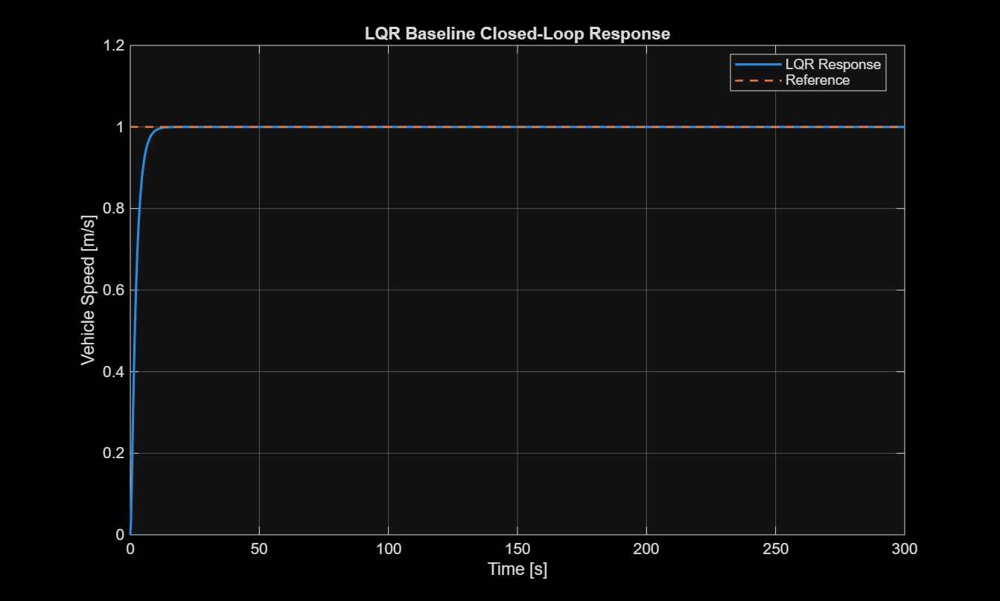

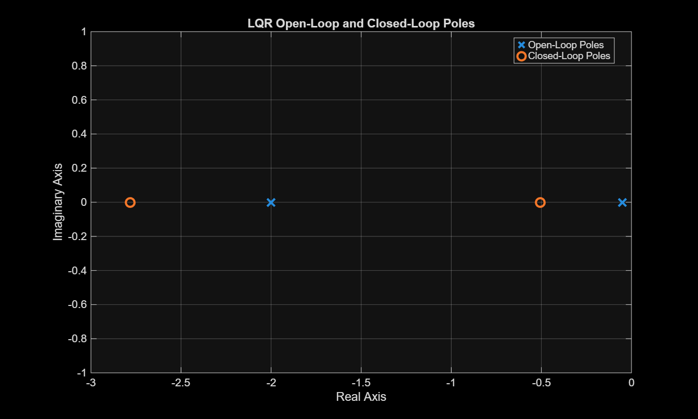

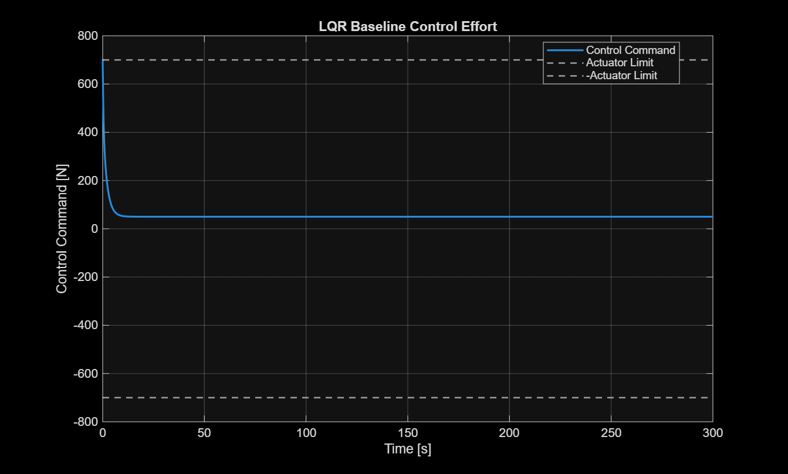

**Engineering outcome:** LQR improves transient performance but requires explicit consideration of actuator capability.

---

# 8. LQR Q/R Sensitivity

The effect of relative state and control weighting was evaluated systematically.

| Case                   |   Q/R | Rise Time | Settling Time | Control Peak | Feasible |
| ---------------------- | ----: | --------: | ------------: | -----------: | :------: |
| Low State Priority     | 0.500 |  4.5196 s |      8.2026 s |     497.50 N |     ✓    |
| Baseline               | 1.000 |  3.2658 s |      5.8542 s |     701.79 N |     ✗    |
| Higher State Priority  | 2.000 |  2.3933 s |      4.1625 s |     991.22 N |     ✗    |
| Higher Control Penalty | 0.500 |  4.5196 s |      8.2026 s |     497.50 N |     ✓    |
| Strong Control Penalty | 0.200 |  7.0000 s |     12.7366 s |     317.02 N |     ✓    |

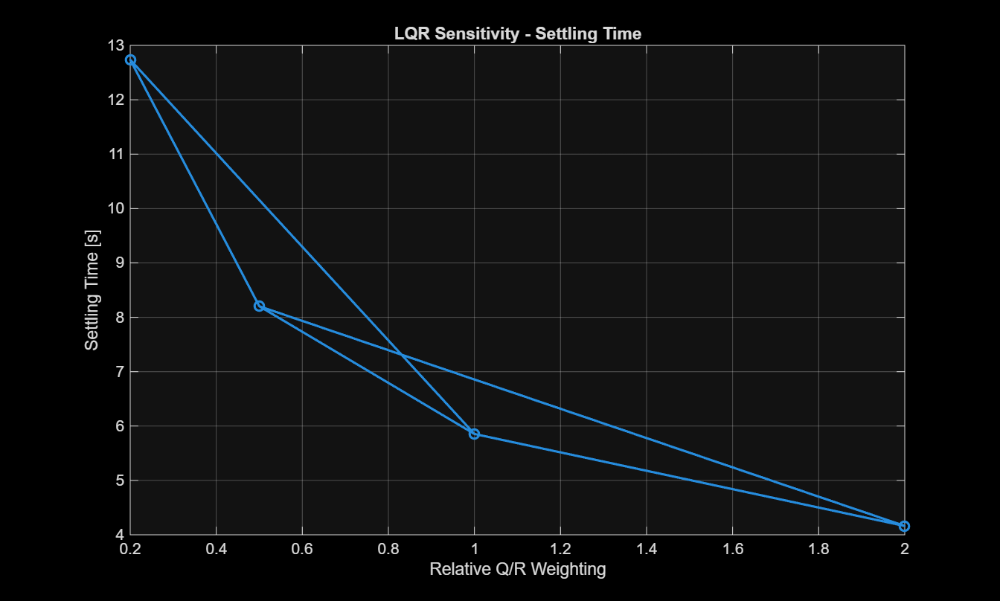

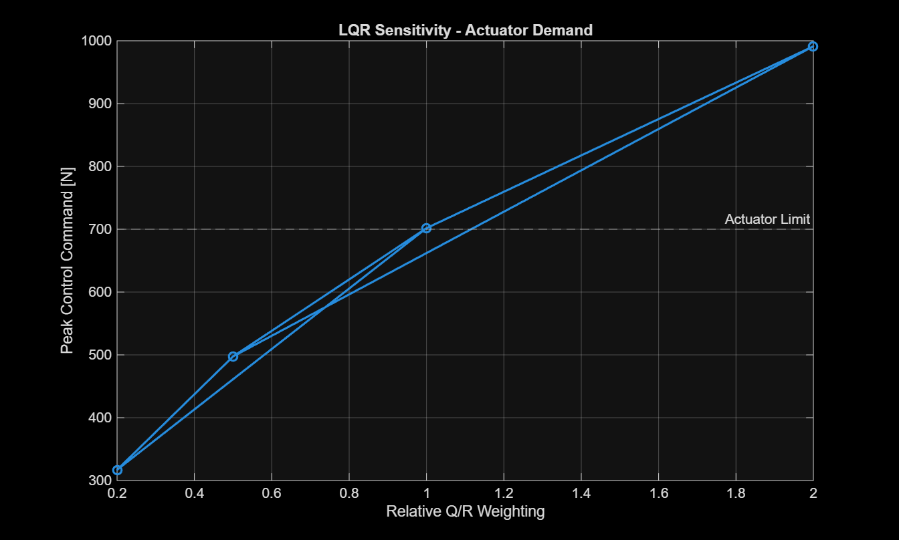

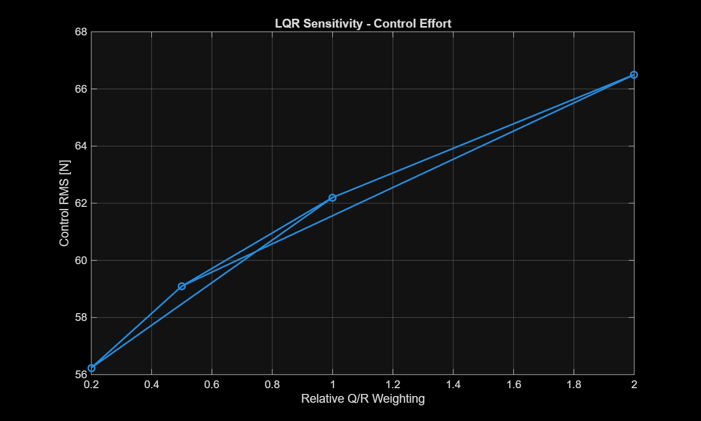

**Engineering outcome:** LQR weighting is a performance-versus-control-effort trade-off. Actuator feasibility is treated as a hard constraint rather than an afterthought.

---

# 9. Actuator Constraint Validation

The unconstrained LQR controller demands:

```text
Raw control peak = 701.786235 N
```

The actuator is limited to:

```text
Maximum actuator force = 700 N
```

The implemented actuator therefore saturates the command.

| Metric                |       Result |
| --------------------- | -----------: |
| Raw control peak      | 701.786235 N |
| Actual control peak   | 700.000000 N |
| Actuator limit        | 700.000000 N |
| Saturated samples     |   5 / 120001 |
| Saturation percentage |     0.0042 % |
| Closed-loop stability |         PASS |
| Tracking              |         PASS |
| Actuator output       |         PASS |

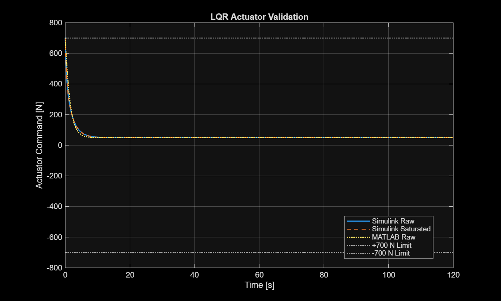

**Engineering decision:** The small, localized saturation event is retained and explicitly validated. The controller passes the final actuator-constrained validation.

---

# 10. MATLAB ↔ Simulink Validation

The controller implementations were independently cross-validated between MATLAB and Simulink.

### P Controller

```text
Maximum Error = 2.306e-06
RMSE          = 4.928e-07
Status        = PASS
```

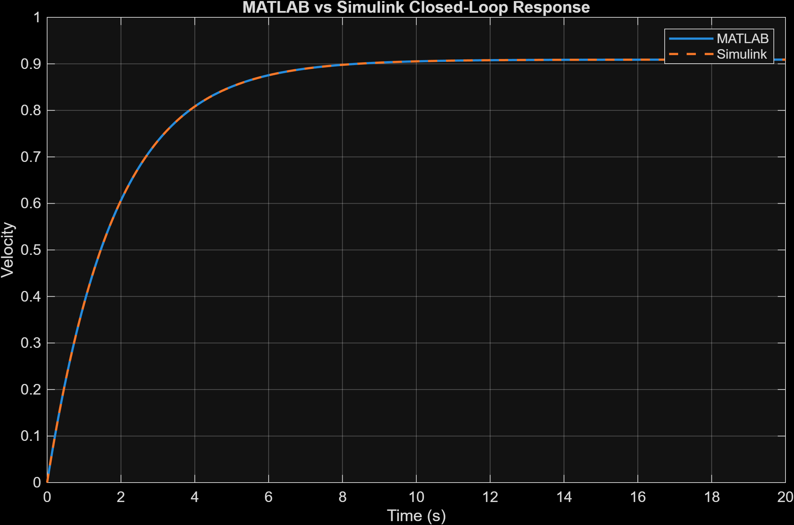

### PI Controller

```text
Maximum Error = 2.096e-06
RMSE          = 2.100e-07
Status        = PASS
```

### PID Controller


The close numerical agreement provides confidence that the MATLAB and Simulink implementations represent the intended control architecture.

---

# 11. Controller Comparison

| Controller   | Primary Role         | Main Observation                              |
| ------------ | -------------------- | --------------------------------------------- |
| P            | Baseline             | Simple but non-zero SSE                       |
| PI           | Tracking improvement | Strong steady-state accuracy                  |
| Filtered PID | Classical benchmark  | Improved transient behaviour                  |
| LQR          | Modern benchmark     | Explicit performance/control-effort trade-off |

The project does not claim that one controller is universally optimal.

Controller selection is treated as an engineering trade-off involving **performance, control effort, implementation practicality and actuator constraints**.

---

# 12. Engineering Workflow

```text
Physical Problem
      ↓
Mathematical Model
      ↓
P Controller
      ↓
Gain Sensitivity
      ↓
PI Controller
      ↓
PID + Derivative Filtering
      ↓
State-Space Model
      ↓
LQR
      ↓
Q/R Sensitivity
      ↓
Actuator Constraint
      ↓
MATLAB Validation
      ↓
Simulink Validation
      ↓
Engineering Decision
```

---

# 13. Repository Structure

```text
Automotive-Cruise-Control-Model-Based-Control
│
├── Documentation
│   ├── Design_Decisions.md.txt
│   └── Engineering_Notes.md.txt
│
├── MATLAB
│   ├── Analysis
│   ├── Controllers
│   ├── Models
│   ├── Reports
│   ├── Utilities
│   └── Validation
│
├── Results
│   ├── Data
│   └── Figures
│       ├── LQR_Controller
│       ├── PID_Controller
│       ├── PI_Controller
│       └── P_Controller
│
├── Simulink
│   ├── CruiseControl_P_Controller.slx
│   ├── CruiseControl_PI_Controller.slx
│   ├── CruiseControl_PID_Controller.slx
│   └── CruiseControl_LQR_Controller.slx
│
├── .gitignore
├── LICENSE
└── README.md
```

---

# 14. Engineering Documentation

Detailed engineering decisions and development notes are maintained separately:

* [`Design_Decisions.md.txt`](Documentation/Design_Decisions.md.txt)
* [`Engineering_Notes.md.txt`](Documentation/Engineering_Notes.md.txt)

The `Results/` directory contains the generated numerical data and engineering plots used during controller analysis and validation.

---

# 15. Skills Demonstrated

**Control Engineering**

* P / PI / PID control
* Derivative filtering
* State-space modeling
* LQR
* Pole analysis
* Controllability
* Sensitivity analysis
* Actuator saturation

**Model-Based Development**

* MATLAB
* Simulink
* Modular model architecture
* Parameterized simulations
* Automated performance analysis
* MATLAB/Simulink cross-validation

**Engineering Practice**

* Requirement-based validation
* Control-effort analysis
* Constraint verification
* Evidence-based controller selection
* Git version control
* Structured engineering documentation

---

# 16. Final Engineering Decision

The project retains four controller stages:

```text
P → PI → Filtered PID → LQR
```

P, PI and PID establish the classical control development path.

LQR provides a modern state-space benchmark and demonstrates the relationship between tracking performance and actuator effort.

The final LQR implementation is validated with the actuator constraint explicitly included.

---

# Project Status

## Completed— PROFESSIONAL V2

The project scope is intentionally done.

The objective is to demonstrate a complete and defensible **model-based automotive control engineering workflow** rather than continuously adding advanced algorithms without a defined engineering requirement.

---

## Author

**Yash Khiste**

M.Sc. Electrical Engineering & Information Technology

**Focus:** Control Systems | Model-Based Development | Simulation | Control Algorithms
